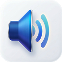

<h1>
  
  <picture>
    <source media="(prefers-color-scheme: dark)" srcset="./assets/tab-volume-manager-wordmark-dark.svg">
    <source media="(prefers-color-scheme: light)" srcset="./assets/tab-volume-manager-wordmark-light.svg">
    
  </picture>
</h1>

Tab Volume Manager is a browser audio workspace for controlling and enhancing the sound of every tab. Version 1.3 combines per-site volume control with quick effects, a visual equalizer, saved presets, and an optional Pro audio suite.

## Free

- Per-tab volume control up to 500%
- Instant mute and volume reset
- Bass Boost and Voice Clarity effects
- Adjustable effect intensity
- Six-band equalizer
- One custom EQ preset
- Per-site settings saved locally
- Light and dark themes

## Pro

- Smart Limiter for cleaner high-volume playback
- Adaptive Volume for balanced loudness
- Movie Dialogue enhancement
- Full 10-band equalizer
- Multi-tab Mixer for every audible tab
- Sleep Timer with a gentle fade-out
- Four custom presets with Monthly or Yearly
- Unlimited presets and volume boost up to 1500% with Lifetime

Pro is available for $2.49 monthly, $14.99 yearly, or $29.99 lifetime. Every plan unlocks the complete Pro audio suite; Lifetime also includes unlimited presets and the extended volume range.

Settings and presets stay in local extension storage. Tab audio is captured and processed only while Tab Volume Manager is active, and Pro licenses are verified through the licensing service.

## License

Copyright (c) 2025-2026 Stefan Mihajlovic. Tab Volume Manager is proprietary software and all rights are reserved. No permission is granted to use, copy, modify, or distribute its source code. See the [LICENSE](./LICENSE) file for the full terms.
